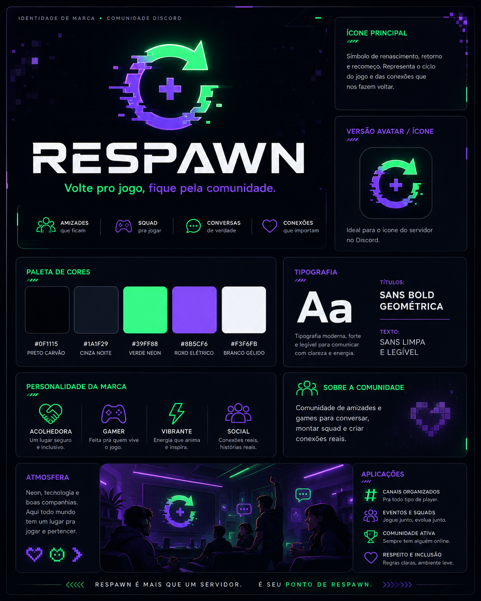
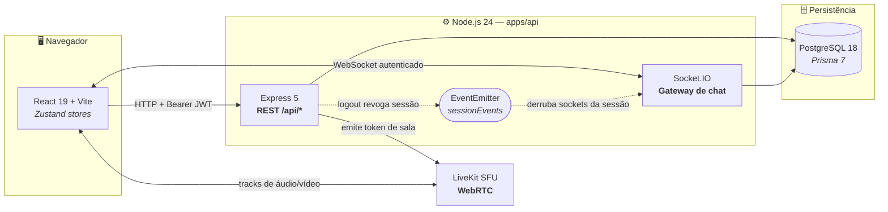
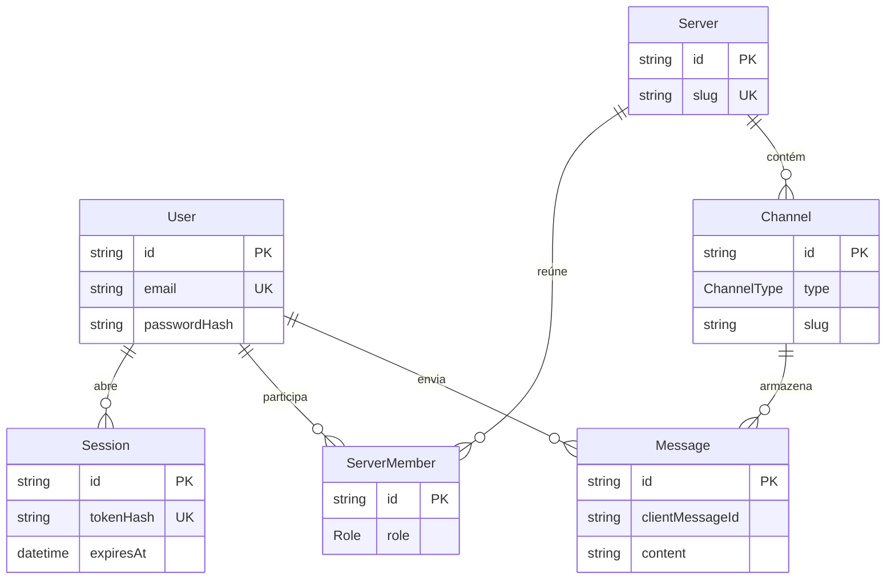

<div align="center">



# RESPAWN

**Plataforma de comunidade para amizades e games** — texto, voz e vídeo em tempo real.

<br/>

[](https://www.typescriptlang.org/)
[](https://nodejs.org/)
[](https://react.dev/)
[](https://vite.dev/)

[](https://www.postgresql.org/)
[](https://www.prisma.io/)
[](https://socket.io/)
[](https://livekit.io/)

<sub>Monorepo NPM Workspaces · Fases 1–3 concluídas e aprovadas em QA · Beta fechada em preparação</sub>

</div>

---

## Sobre

O **Respawn** é uma plataforma de comunidade completa, no espírito de um Discord: servidores, canais de texto e voz, mensagens em tempo real, presença de membros e salas de voz/vídeo com WebRTC.

O projeto nasceu com três compromissos técnicos que atravessam todas as decisões de arquitetura:

- **Tipagem de ponta a ponta** — o mesmo TypeScript vai do schema do banco (Prisma) até o componente React, sem camada de `any` no meio.
- **Tempo real de verdade** — mensagens, presença e "está digitando" trafegam por WebSocket com reconexão resiliente e resync de histórico, não por polling.
- **Cobertura automatizada por incremento** — cada comportamento entra com teste, e nenhuma etapa é fechada sem o gate completo passar. A política está em [`AGENTS.md`](./AGENTS.md).

---

## Stack tecnológica

### Frontend — `apps/web`

| Camada | Tecnologia | Por quê |
| --- | --- | --- |
| Framework | **React 19.2** | Base da UI, com Server-free SPA e History API nativa |
| Build | **Vite 8.2** | HMR instantâneo em dev, bundle otimizado em produção |
| Estilização | **Tailwind CSS 3.4** | Design system da marca aplicado direto no markup |
| Estado | **Zustand 5** | Stores enxutas para chat e voz, sem boilerplate de Redux |
| Ícones | **lucide-react 1.33** | Conjunto coerente com a estética neon do produto |
| Tempo real | **socket.io-client 4.8** | Reconexão automática e replay controlado |
| Mídia | **livekit-client 2.22** | Publicação e assinatura de tracks WebRTC |
| Testes | **Vitest 4 · Testing Library · jsdom** | Testes de componente e de store no mesmo runner do Vite |

### Backend — `apps/api`

| Camada | Tecnologia | Por quê |
| --- | --- | --- |
| Runtime | **Node.js ≥ 24** | ESM nativo, `--env-file-if-exists`, test runner embutido |
| HTTP | **Express 5.2** | Roteamento estável e maduro para a superfície REST |
| WebSocket | **Socket.IO 4.8** | Gateway de chat com salas por canal e handshake autenticado |
| Validação | **Zod 4.4** | Contratos de entrada e configuração de ambiente validados em runtime |
| Auth | **jsonwebtoken 9 · bcrypt 6** | JWT de sessão + hash de senha com 12 rounds |
| Voz/vídeo | **livekit-server-sdk 2.18** | Emissão de tokens de acesso às salas |
| Testes | **`node:test`** | Suítes e2e sem dependência extra, rodando contra Postgres real |

### Dados — `packages/database`

| Camada | Tecnologia | Por quê |
| --- | --- | --- |
| Banco | **PostgreSQL 18.6** | Relacional para usuários, servidores, canais e mensagens |
| ORM | **Prisma 7.9** | Migrações versionadas e client totalmente tipado |
| Driver | **`@prisma/adapter-pg` + `pg` 8.23** | Driver adapter: conexão via `pg`, sem engine binário nativo |

### Infraestrutura

| Componente | Tecnologia |
| --- | --- |
| Orquestração local | **Docker Compose** (`compose.yaml`) |
| SFU de mídia | **LiveKit Server v1.13.5** (digest fixo, para QA reproduzível) |
| Monorepo | **NPM Workspaces 11** + **TypeScript Project References** |

---

## Arquitetura



O detalhe que amarra o sistema: **REST e WebSocket compartilham um único `EventEmitter`**. Quando `POST /api/auth/logout` revoga uma sessão, o gateway — que assina o mesmo emitter — derruba na hora qualquer socket daquela sessão. Sem isso, um token revogado continuaria recebendo mensagens até o socket cair sozinho.

---

## Identidade visual

Estética gamer moderna: grafite escuro, neon e tipografia geométrica.

| | Token | Hex | Uso |
| --- | --- | --- | --- |
|  | `respawn.base` | `#0F1115` | Fundo principal |
|  | `respawn.panel` | `#1A1F29` | Painéis e sidebars |
|  | `respawn.neon` | `#39FF88` | Ação, presença online, voz ativa |
|  | `respawn.purple` | `#8B5CF6` | Destaques e cargos |
|  | `respawn.ice` | `#F3F6FB` | Texto sobre fundo escuro |

Sombras (`neon-soft`, `purple-soft`, `panel`) e o tracking `digital` (`0.18em`) estão definidos em [`apps/web/tailwind.config.js`](./apps/web/tailwind.config.js).

**Hierarquia de cargos:** `NOVATO` · `PLAYER` · `SQUADMATE` · `VETERAN` · `MVP` · `ELITE` · `MOD` · `ADMIN`

---

## Modelo de dados



Sessões são persistidas por **hash do token** (`tokenHash`, SHA-256), nunca pelo token em si — o valor no banco não serve para autenticar. `Message.clientMessageId` dá idempotência ao envio, evitando duplicata quando o cliente reenvia após reconexão.

---

## Superfície da API

### REST

| Método | Rota | Descrição |
| --- | --- | --- |
| `POST` | `/api/auth/register` | Cria usuário e devolve sessão |
| `POST` | `/api/auth/login` | Autentica e devolve JWT |
| `GET` | `/api/auth/session` | Valida a sessão corrente (`Authorization: Bearer`) |
| `POST` | `/api/auth/logout` | Revoga a sessão no servidor e derruba os sockets |
| `GET` | `/api/chat/channels/:slug/messages` | Histórico paginado do canal |
| `GET` | `/api/chat/members` | Membros e status de presença |
| `POST` | `/api/voice/token` | Token de acesso a uma sala LiveKit |

### Eventos WebSocket

| Direção | Evento | Payload |
| --- | --- | --- |
| ⬇️ servidor | `connection:ack` | Confirma handshake autenticado |
| ⬆️ cliente | `channel:join` | Entra na sala do canal |
| ⬆️ cliente | `message:send` | Envia mensagem (com `clientMessageId`) |
| ⬇️ servidor | `message:new` | Difunde mensagem ao canal |
| ⬆️ cliente | `typing:start` / `typing:stop` | Sinaliza digitação |
| ⬇️ servidor | `typing:update` | Lista de quem está digitando |
| ⬇️ servidor | `presence:update` | Entrou/saiu, online/offline |

---

## Começando

### Requisitos

- **Node.js ≥ 24** e **npm ≥ 11**
- **Docker Desktop** com Docker Compose

### Instalação

```bash
npm install
cp .env.example .env
```

Gere um `JWT_SECRET` próprio (a API recusa segredos com menos de 32 bytes):

```bash
node -e "console.log(require('node:crypto').randomBytes(48).toString('base64url'))"
```

### Banco de dados

```bash
npm run db:up        # sobe o PostgreSQL (somente em 127.0.0.1:5432)
npm run db:migrate   # aplica as migrações
```

### API + Frontend

```bash
npm run api:start    # API em 127.0.0.1:3001
npm run web:dev      # Vite em http://localhost:5173
```

Em desenvolvimento, o Vite encaminha `/api` e `/socket.io` para a API — não é preciso configurar CORS nem `VITE_API_URL`. Após o login, a aplicação abre em `/channels/respawn-hq/spawn-point`.

### Voz e vídeo (LiveKit local)

> [!IMPORTANT]
> Informe em `.env` o **IPv4 LAN** da interface usada pelo host Docker — no Windows, o campo `Endereço IPv4` do `ipconfig`. Candidatos ICE de loopback **não** atravessam o encaminhamento RTC do Docker Desktop, então `127.0.0.1` não funciona.

```dotenv
LIVEKIT_NODE_IP=192.168.0.10
```

```bash
npm run voice:up
```

A sinalização fica em `127.0.0.1:7880`; as portas RTC `7881/tcp` e `7882/udp` são publicadas pelo host e anunciadas com o `LIVEKIT_NODE_IP`.

---

## Comandos

| Comando | O que faz |
| --- | --- |
| `npm run check` | **Gate completo**: Prisma Client → build → typecheck → validate → testes da API → testes do web |
| `npm run build` | Compila os workspaces (`tsc --build`) e gera o bundle do frontend |
| `npm run typecheck` | Typecheck de todos os workspaces |
| `npm run api:start` / `api:test` | Sobe a API / roda as suítes e2e |
| `npm run web:dev` / `web:build` / `web:test` | Dev server / bundle de produção / Vitest |
| `npm run db:up` / `db:down` / `db:logs` | Ciclo de vida do PostgreSQL |
| `npm run db:migrate` / `db:status` / `db:validate` | Migrações e schema |
| `npm run voice:up` / `voice:down` / `voice:logs` | Ciclo de vida do LiveKit |

---

## Estrutura

```text
respawn/
├── apps/
│   ├── api/                  API Node.js — REST, WebSocket, tokens LiveKit
│   │   └── src/
│   │       ├── modules/      auth · chat · voice
│   │       ├── config/       validação de ambiente (Zod)
│   │       └── shared/       erros HTTP e helpers de rota
│   └── web/                  SPA React
│       └── src/
│           ├── components/   UI e blocos da comunidade
│           ├── layouts/      MainLayout, AuthShell
│           ├── stores/       chat-store, voice-store (Zustand)
│           ├── lib/          clients de API, WebSocket e roteamento
│           └── assets/       imagens da marca
├── packages/
│   ├── database/             schema Prisma, migrações e client compartilhado
│   └── ui/                   componentes visuais reutilizáveis
├── docs/                     material de apoio e branding
├── compose.yaml              PostgreSQL + LiveKit para desenvolvimento
└── AGENTS.md                 política de colaboração entre agentes
```

---

## Testes e qualidade

O gate de conclusão é único e não negociável: **`npm run check` precisa passar por inteiro**.

- **API** — suítes e2e com `node:test` contra um PostgreSQL real, cobrindo registro, login, sessão, revogação, chat e emissão de token de voz.
- **Frontend** — Vitest + Testing Library sobre componentes, stores, roteamento e o cliente WebSocket.
- **Manual** — fluxos visuais e de tempo real são validados com duas sessões simultâneas antes de fechar cada fase.

Nenhuma etapa é marcada como aprovada pelo próprio agente que a implementou; a aprovação final é do agente de QA, conforme [`AGENTS.md`](./AGENTS.md).

---

## Roadmap

| Fase | Escopo | Status |
| --- | --- | --- |
| **1** | Fundação, monorepo, autenticação e layout base | ✅ Concluída |
| **2** | Motor de chat em tempo real (WebSocket, presença, typing) | ✅ Aprovada em QA |
| **3** | Voz e vídeo com LiveKit (presets 720p/1080p, 30/60 FPS) | ✅ Concluída |
| **4** | Aplicação desktop nativa (Tauri) | ⛔ Removida do escopo |
| **5** | Deploy e beta fechada | 🔨 Em andamento |
| **6** | Menções, cargos, moderação e beta aberta | 📋 Planejada |

Detalhamento em [`task.md`](./task.md) e [`implementation_plan.md`](./implementation_plan.md).

---

## Segurança

Antes de expor a API publicamente:

- Gerar segredos de produção próprios — **nunca** reaproveitar os valores de desenvolvimento do `.env.example`.
- Aplicar **rate limiting** no proxy ou em uma camada compartilhada com Redis.
- Adicionar confirmação de propriedade do e-mail no registro.
- `LIVEKIT_URL` precisa usar **`wss://`** — a API recusa `ws://` fora de `NODE_ENV=development`.

Em hospedagem estática, configure o servidor para reescrever `/channels/*` para `index.html`, preservando os deep links.

---

<div align="center">
<sub>Projeto privado · <code>UNLICENSED</code></sub>
</div>
